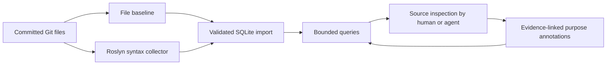

# How the analyzer works

Suppose an agent is investigating a large repository. Before it proposes a refactor, it needs to know
what types exist, where responsibilities live, and which areas deserve a closer look. Reading every
file into one conversation is expensive and difficult to navigate. A giant generated report has the
same problem in another format.

For a real repository walkthrough, see the [Netclaw case study](netclaw-case-study.md): collect a pinned
snapshot, query two shell-related types, inspect their responsibilities, and expose a misleading name count.

This tool builds a **queryable inventory of evidence**. The agent can ask for a small set of declarations,
inspect their source, and add a concise explanation of their purpose. The database does not decide
that something is bad architecture, duplicate functionality, or safe to delete.

## The pipeline



There is no background server, automatic LLM call, or requirement to build the target application.
The three programs can be run without either skill. The skills supply the investigation and judgment
that measurements alone cannot provide.

## 1. Pin down exactly what is being measured

[`repository_baseline.py`](../skills/architecture-assessment/scripts/repository_baseline.py) resolves
a Git revision, enumerates its tree, and reads regular file blobs through `git cat-file --batch`.
It does not substitute the current on-disk content. Checkout line-ending filters therefore cannot
silently change the measured source or its hash.

For each file it records its path, extension, Git blob ID, SHA-256, byte size, and—where the content is
UTF-8 text without NUL bytes—physical and nonblank line counts. Comments count as lines. Binary or
unmeasurable text gets an explicit status rather than a fabricated line count. Symlinks and submodule
contents are excluded. Non-C# files remain in this inventory.

The standalone baseline supports `--revision`; the C# collector measures `HEAD`. Use a worktree at the
desired revision when combining them. Unlike the baseline, the C# collector rejects tracked working-tree
changes, and checks for HEAD/cleanliness drift again before emitting results. Untracked files are not
included. Both inputs must describe the same snapshot.

## 2. Parse C# into syntax trees

[`csharp-metrics.cs`](../skills/architecture-assessment/scripts/csharp-metrics.cs) is a single-file
.NET application using the SDK's bundled Roslyn assemblies. It reads the committed bytes of each
regular lowercase `.cs` file, decodes them, and calls `CSharpSyntaxTree.ParseText`.

That creates a syntax tree, **not a compilation or semantic model**. It does not load a solution,
evaluate MSBuild conditions, run source generators, resolve package references, or discover active
project membership. Default parser symbols are used; directives and parse errors are reported.
Inactive conditional branches are not inventoried like active code.

The first pass retains trees and measures files. The second creates declaration profiles and records
possible name usages across all parsed files. Gathering names first means file order doesn't determine
which names can be found later.

### What counts as an entity?

Class, struct, interface, record, enum, and delegate declarations receive rows. Methods and properties
do not receive their own entity rows in this prototype. Each declaration has:

- A syntax-location ID: `path:offset`, where offset is Roslyn's text span start, not a UTF-8 byte offset.
- A simple name, descriptive qualified name, generic arity, syntax kind, and modifiers.
- A 1-based start/end line, nearest enclosing declaration ID, and written base-type names.
- Method-declaration count, defined branch-node count, and maximum constructor parameter count.

Partial declarations remain separate. IDs are unique within a snapshot, not stable logical type IDs
across edits. Namespace-qualified labels help humans read rows; they do not resolve compiler identity.

Nested types get their own measurements. The enclosing declaration's method/branch/constructor
measurements exclude nested declaration bodies, although its physical line span still contains them.

### What are the metrics looking for?

| Observation | Useful question | What it does not prove |
|---|---|---|
| File size/physical lines | Where is source concentrated? | Architectural quality, logical source LOC, or work delivered |
| Branch nodes | Where are many decisions expressed? | Cyclomatic complexity or a defect |
| Constructor parameter count | Does this object own too many responsibilities? | A data record or legitimate adapter is overcomplicated |
| Defaulted parameters (file-level JSON) | Are many optional modes being accumulated? | Every optional parameter is wrong |
| Method declarations | Which types deserve closer inspection? | Total public API size; accessors/local functions aren't method declarations |
| Same-name candidates | Where might a declaration be used? | Bound references, runtime instances, reachability, or safe removal |

The branch proxy counts `if`, the listed loop forms, `catch`, ternary expressions, switch sections,
and switch-expression arms. It does not add Boolean operators or a complexity baseline. Words in
comments and strings don't count as branch syntax. The source's `branch_definition` explains the
measurement; do not rename it "cyclomatic complexity" in a report.

Tests, benchmarks, generated files, and vendored files are not silently removed. Classify them before
comparing production metrics. A directory named `src` does not establish that everything inside is
production code.

## 3. Find names, not symbols

The collector builds a set of declared **simple names**. It walks `SimpleNameSyntax` nodes and records
matching names, their generic arity, file, offset, line, containing declaration, and immediate syntax
context. The SQLite view then counts matches by **name and arity**.

For example, these declarations are distinct:

```csharp
namespace Billing { public record Params(int Attempts); }
namespace Reporting { public record Params(string Title); }
```

If code refers once to `Billing.Params` and once to `Reporting.Params`, each profile receives a pooled
count of two name occurrences and reports two same-name declarations. It does **not** have two proven
references to each type. Even the qualified call sites are not bound to symbols by this pipeline.

Unrelated properties or variables can match a type's name. Aliases and implicit constructions can
hide references. Generic syntax arity helps distinguish some spellings but does not solve identity.
`lexical_owner_count` counts distinct enclosing declaration IDs among the matching names, not proven
dependent types. A single same-name declaration does not make a match semantically certain.

To get exact static relationships, a future collector would need project/configuration-aware compiler
binding. Even that would not fully explain runtime reflection, DI registrations, plugins, external
consumers, or frontend-to-backend calls. The current tool does not implement this semantic collector.

## 4. Import consistent evidence into SQLite

[`architecture_catalog.py`](../skills/architecture-assessment/scripts/architecture_catalog.py) accepts
the file baseline and C# schema-2 JSON. Before importing, it verifies matching commits, analyzed file
hashes, exactly one analysis row per expected lowercase `.cs` file, and matching declaration totals.
Foreign keys reject missing files and dangling entity relationships.

This catches stale inputs, incomplete inventories, and malformed relationships. It cannot prove that
the analysis itself is correct. Metadata preserves collector/compiler identity, input hashes,
scope, diagnostics, and exclusions so consumers can interpret the numbers.

One database contains one snapshot. Creation refuses to overwrite an existing file. If creation fails,
the importer removes only its newly created database. Parent relationships are deferred until transaction
commit so declaration input order needn't place every parent first.

The [schema and recipes](sqlite.md) explain each table. The important split is:

- **Observed facts:** files, declarations, syntax counts, names, and base-type text.
- **Interpretations:** a separately authored purpose, confidence label, and source evidence.
- **Convenience indexes/views:** combined profiles and full-text purpose search.

Not every JSON measurement becomes a dedicated SQL column. File-level constructor details and defaulted
parameter counts remain in the analysis JSON; SQL profiles hold the declaration metrics described above.
Retain the inputs if you need their full detail.

## 5. Add an explanation without pretending it is a fact

An agent can query a few declarations, read source and representative consumers, inspect composition
roots and tests, and submit annotations through `annotate`. It must supply the snapshot repository and
commit, known entity IDs, a nonempty purpose and author, confidence (`low`, `medium`, or `high`), and
evidence pointing at valid lines in measured files.

Each batch is atomic: invalid evidence rolls back its changes. Purpose text and its full-text index
update together. Re-annotating an entity replaces its previous interpretation; this is not an audit log
of every prior model opinion. Empty purpose means **unassessed**, not purposeless.

These checks establish provenance, not truth. A source citation can still support a bad inference.
Confidence is a human/model judgment label, not a calculated probability. Independent source review
remains valuable. Nothing automatically calls a model or fills in missing purposes.

## 6. Turn observations into a useful assessment

`architecture-assessment` always tries the bundled analyzer first, after minimal scope and toolchain
discovery. For C#, it collects the Git baseline and Roslyn output, builds SQLite, and queries a bounded
set of leads before inspecting implementation bodies. If tooling fails, it reports the blocker and
missing evidence before a bounded manual fallback; it must not quietly skip collection. Non-C# scopes
use the Git baseline without requiring Roslyn. A matching, verified catalog can be reused.

The skill uses this inventory alongside direct source investigation to explain ownership,
contracts, important journeys, and gaps. `simplify` then asks whether a smaller arrangement can preserve
the behavior that matters. Similar names, a large constructor, or a high branch count are not findings
by themselves. Two implementations may legitimately differ in authority, lifecycle, or compatibility.

A proposal should explain actual code, alternatives, counterevidence, what disappears, what replaces it,
and how to verify the change. It may conclude that no consolidation is justified. The optional HTML
template makes a proposal easier to review; the database is not itself a user-facing specification.

## Operational limits

- Regenerate for changed source, collector/schema, or relevant configuration. A branch name is not a
  cache key. Don't transfer offset-based annotations to another snapshot without rechecking them.
- Keep output ignored and local. It can reveal private file/type names and inferred business behavior.
  Serving a proposal must not expose the underlying repository or database.
- `query` returns at most 100 rows by default and reports truncation. It opens read-only and blocks
  database attachment; it is not a resource-limited sandbox for arbitrary untrusted SQL or databases.
- Mixed-language files share the baseline inventory, but only C# declarations currently have an importer.
  JavaScript/HTML/CSS entity adapters and cross-language dependency resolution are not implemented.
- Trees and result lists are retained in memory; this is not an incremental or streaming indexer.
  Profile actual collection/query cost on your repository before making scale claims.

For another language, preserve the distinction between observed structure and bound relationships,
declare coverage honestly, and test snapshot/identity boundaries. A language-neutral importer contract
would be a deliberate extension, not something the existing C# schema already provides.

**Bottom line:** the catalog helps decide where to look. Source inspection and verification decide
what can safely change. See the [worked example](example.md) for actual, reproducible output.
